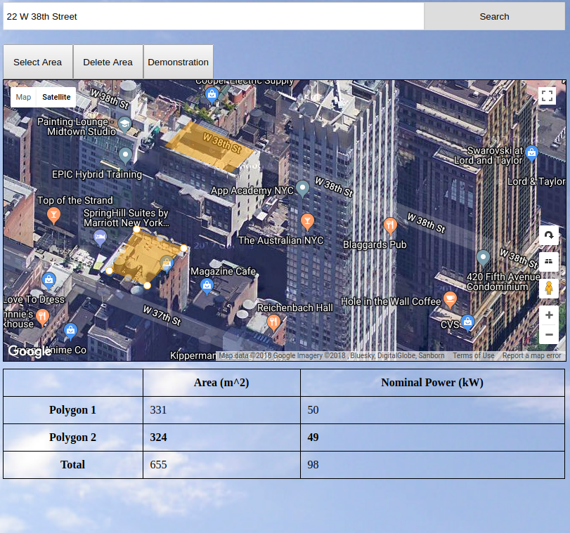

# Solar Calculator
--------------------
[Live](paulangland.info/Solar-Calculator)


## Description ##
This app is a simple solar calculator that enables users to calculate the approximate nominal power of solar panels placed on a given patch of land or rooftop. The user is provided a map and allowed to search for addresses and draw shapes on the map that correspond to collections of solar panels.

## Implementation ##
The application is a simple React application that incorporates the Google Map api, which provides both location lookup and the ability to draw shapes on the map. When a polygon is completed, the application adds a listener to the polygon so that, if clicked on, the google maps will select that polygon and state will update to reflect that this polygon is selected. Then, an object is created to represent that shape that contains the google map polygon reference and the area of that shape. That object is pushed into the state, and that shape is selected automatically on creation.

```javascript
google.maps.event.addListener(e.overlay, 'click', () => {
  this.setCurrentShape(e.overlay);
});

this.setCurrentShape(e.overlay);

const newAreaList = this.state.shapes;

newAreaList.push({polygon: this.currentPolygon, area: area});

this.setState({
  shapes: newAreaList,
  selected: newAreaList.length - 1
});
```
When you have at least one polygon, a table is rendered that shows the nominal power generated from each solar panel collection and the total nominal power.

```javascript
// inside an iterator that reviews all shapes:
const className = this.props.selected === shapeNum ? "selected data" : "data";
const nominalPower = calculateNominalPower(shape.area);

totalArea += shape.area;
totalNominalPower += nominalPower;

return (
  <tr
    className={className}
    key={shapeNum}
    onClick={this.props.handleSelect.bind(this, shapeNum)}>

    <th>Polygon {shapeNum +1}</th>
    <td>{Math.round(shape.area)}</td>
    <td>{Math.round(nominalPower)}</td>
  </tr>
);
```
Note that while the areas and nominal power of each polygon are rounded, the total sums are based on the non-rounded values so that they are more accurate.

## Further Notes ##
This project is a very simple solar calculator. For greater accuracy, the application would either have to know the slope of the rooftops and their orientations or allow users to input those values.
